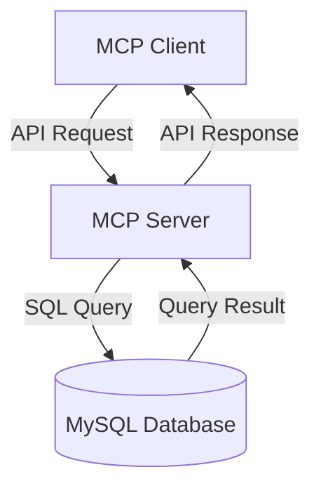
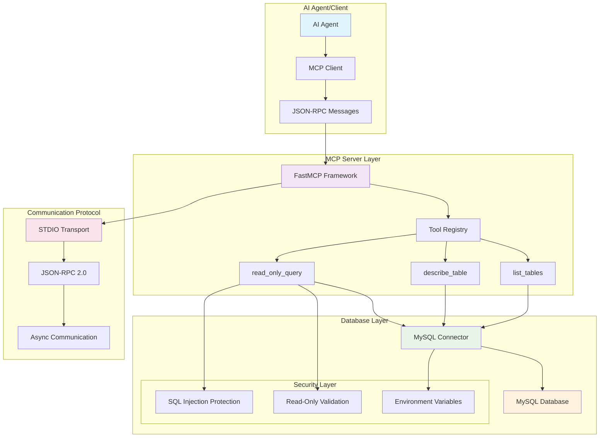
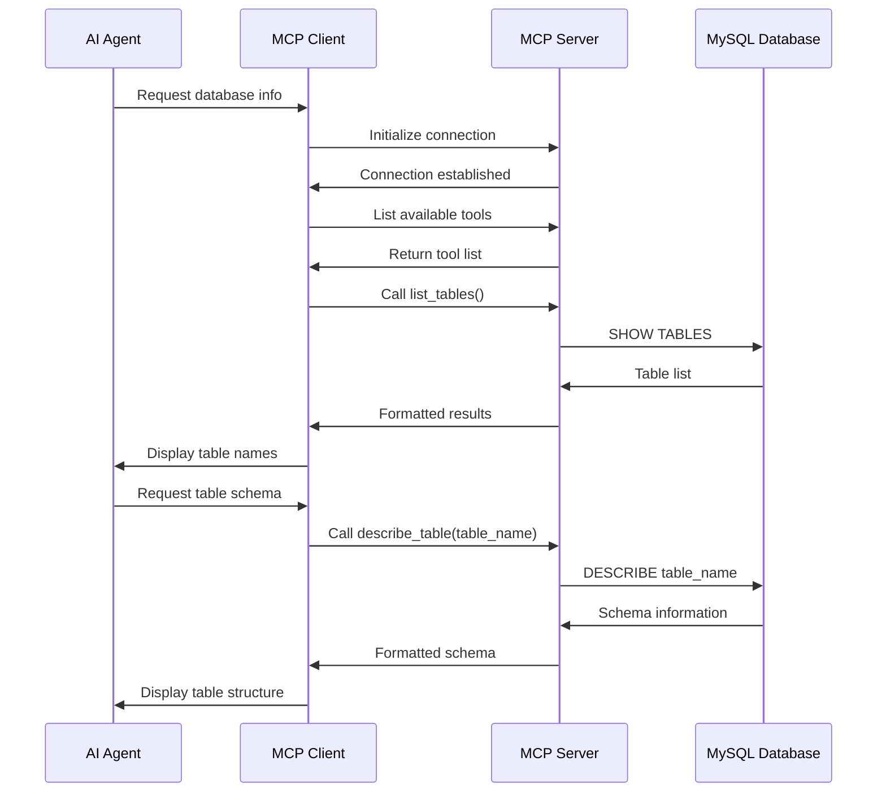

# MySQL MCP Server
#
## High-Level Architecture (Simple)



A Model Context Protocol (MCP) server that enables AI agents to safely interact with MySQL databases through a standardized interface.

## 🏗️ Architecture Overview

This project implements a client-server architecture using the MCP protocol, allowing AI agents to query MySQL databases securely.



## 🧩 Components Breakdown

### 1. **MCP Client (`mcp_client.py`)**
- **Purpose**: Demonstrates how to connect to and interact with the MCP server
- **Key Features**:
  - Establishes connection via STDIO transport
  - Sends JSON-RPC messages for initialization
  - Lists available tools and calls them
  - Handles async communication with the server

### 2. **MCP Server (`server.py`)**
- **Purpose**: Main server implementation that handles client requests
- **Key Features**:
  - FastMCP framework integration
  - Tool registration and management
  - Database connection handling
  - Security validation

### 3. **Database Tools**
#### `list_tables()`
- **Function**: Returns all tables in the connected database
- **SQL**: `SHOW TABLES;`
- **Output**: Simple list of table names

#### `describe_table(table_name)`
- **Function**: Shows schema information for a specific table
- **SQL**: `DESCRIBE table_name;`
- **Output**: Formatted table structure with columns, types, keys, etc.

#### `read_only_query(query)`
- **Function**: Executes safe SELECT queries only
- **Security**: Validates query starts with "SELECT"
- **Output**: Formatted table results

### 4. **Database Connection (`get_db_connection()`)**
- **Purpose**: Manages MySQL database connections
- **Features**:
  - Environment variable configuration
  - Error handling and connection pooling
  - Automatic cleanup of resources

### 5. **Configuration (`secrect_api_keys.py`)**
- **Purpose**: Stores API keys and configuration
- **Note**: This file should be added to `.gitignore` in production

## 🔧 Installation & Setup

### Prerequisites
- Python 3.8+
- MySQL Server
- pip package manager

### Step 1: Clone and Setup
```bash
git clone <your-repo>
cd MCP
python -m venv venv
```

### Step 2: Activate Virtual Environment
```bash
# Windows
venv\Scripts\activate

# macOS/Linux
source venv/bin/activate
```

### Step 3: Install Dependencies
```bash
pip install -r requirements.txt
```

### Step 4: Environment Configuration
Create a `.env` file:
```env
DB_HOST=localhost
DB_USER=your_username
DB_PASSWORD=your_password
DB_NAME=your_database
DB_PORT=3306
```

## 🚀 Usage

### Starting the Server
```bash
python server.py
```

### Running the Client
```bash
python mcp_client.py
```

### Example Client-Server Interaction
1. **Initialization**: Client sends `initialize` request
2. **Tool Discovery**: Client requests available tools via `tools/list`
3. **Tool Execution**: Client calls specific tools with `tools/call`
4. **Response**: Server returns formatted results

## 🔒 Security Features

### Query Validation
- Only SELECT queries are allowed
- SQL injection protection through parameterized queries
- Read-only access enforced at application level

### Connection Security
- Environment variable configuration
- No hardcoded credentials
- Automatic connection cleanup

### Error Handling
- Graceful failure handling
- No sensitive information exposure
- Connection timeout management

## 📊 Data Flow



## 🛠️ Development

### Adding New Tools
1. Create a new function in `server.py`
2. Decorate with `@mcp.tool()`
3. Add proper error handling
4. Update documentation

### Testing
```bash
# Test database connection
python -c "from server import get_db_connection; print(get_db_connection())"

# Test tool execution
python mcp_client.py
```

## 📁 Project Structure
```
MCP/
├── server.py              # Main MCP server implementation
├── mcp_client.py          # Example client for testing
├── requirements.txt        # Python dependencies
├── secrect_api_keys.py    # Configuration file
├── README.md              # This file
└── venv/                  # Virtual environment
```

## 🔮 Future Enhancements

- [ ] Add more database operations (INSERT, UPDATE, DELETE with proper validation)
- [ ] Implement connection pooling for better performance
- [ ] Add support for other database types (PostgreSQL, SQLite)
- [ ] Create web-based admin interface
- [ ] Add authentication and user management
- [ ] Implement query caching and optimization
- [ ] Add comprehensive logging and monitoring

## 🤝 Contributing

1. Fork the repository
2. Create a feature branch
3. Make your changes
4. Add tests if applicable
5. Submit a pull request

## 📚 Resources

- [MCP Protocol Documentation](https://modelcontextprotocol.io/)
- [FastMCP Framework](https://github.com/jlowin/fastmcp)
- [MySQL Connector Python](https://dev.mysql.com/doc/connector-python/en/)
- [JSON-RPC 2.0 Specification](https://www.jsonrpc.org/specification)

## 📄 License

This project is licensed under the MIT License - see the LICENSE file for details.

## 🆘 Support

If you encounter any issues or have questions:
1. Check the error logs
2. Verify your database connection
3. Ensure all dependencies are installed
4. Open an issue in the repository

---

**Happy coding! 🚀**
